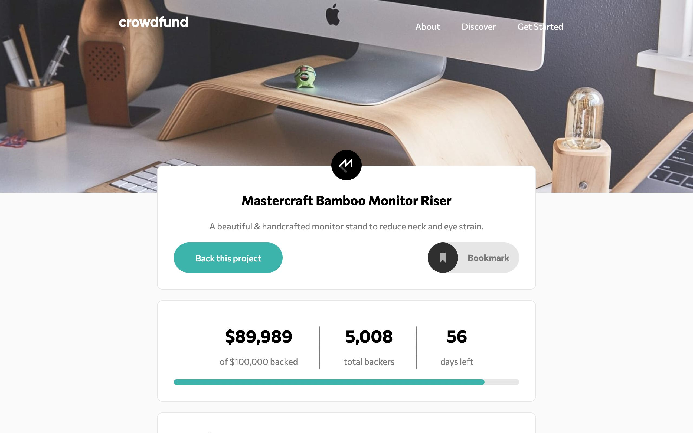

# Frontend Mentor - Crowdfunding product page solution

## Table of contents

- [Overview](#overview)
  - [Links](#links)
- [My process](#my-process)
  - [Built with](#built-with)
  - [What I learned](#what-i-learned)
  - [Continued development](#continued-development)
  - [Useful resources](#useful-resources)
- [Author](#author)
- [Acknowledgments](#acknowledgments)

## Overview



### Links

- Solution URL: [Crowdfunding Product Page Solution](https://www.frontendmentor.io/solutions/crowdfuncing-product-page-challenge-JcuKwJ8zA)
- Live Site URL: [Crowdfunding Product Page](https://simple-front-end-mentor-challenges.vercel.app/Crowdfunding-Product-Page/index.html)

## My process

### Built with

- Semantic HTML5 markup
- Popup Modal with JS
- CSS custom properties
- Flexbox
- Mobile-first workflow

### What I learned

Implemeted Modal with JS the first time and learnt about how to use localStorage and save the text necessary for implementing the bookmark. 

Learnt about svg elements scretch automatically when used with flex, so best to use ```align-self``` on svg images. 

```setTimeOut()``` method is one of the main things that i learnt about while working, didn't know i could make code wait for some time and then load

Didn't know i could scroll something into view without using id, which is the most popular way to do that, used ```scrollIntoView``` to scroll the pledge into view

Something that i came to know by mistake was ```cursor: not-allowed;``` it was small thing, but i was amazed i could do that with css, also checked out other properties in [W3Schools](https://www.w3schools.com/cssref/pr_class_cursor.asp)

Also came to know about changing the color of svg elements it's not something i expected like ```color``` or ```background-color```, It was ```fill```, i had read about it while learning css but had forgotten about it, now i know how to change the colors of svg elements

### Continued development

Web Components are things that i want to learn to make like modal, tabs, accordions, i have never made them, this was first time of me making web components using js, it would be a very good skill to have.

### Useful resources

- [Set Time Out](https://www.w3schools.com/jsref/met_win_settimeout.asp) - This helped me for to make code wait.

## Author

- Website - [Abu Ubada](https://www.newlifeintro.epizy.com)
- Frontend Mentor - [@Abu-Ubada2020](https://www.frontendmentor.io/profile/Abu-Ubada2020)
- Twitter - [@ab_coding](https://twitter.com/ab_coding)

## Acknowledgments

W3Schools, MDN are the best suited candidates here whose documentations are amazing, and looks like a lot of interactive that a dull book to read and copy from
